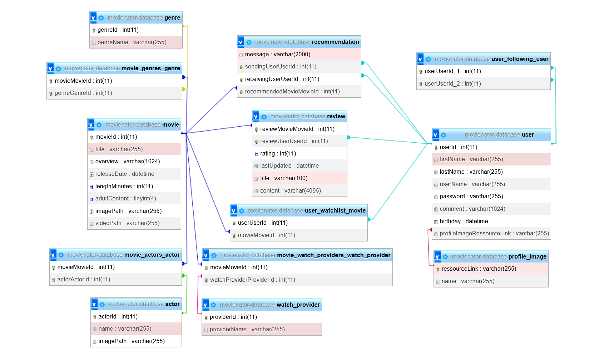

# MOVIENATOR 3000

Gliederung:

- Projektidee
- Starten der Anwendung
- Tech Stack
- Datenstruktur
- Angebundene APIs
- Testing
- Funktionalitäten
- API Dokumentation

## Projektidee

Ziel des Projektes war es, eine Platform zu entwickeln, auf der Nutzer neue Filme entdecken und bereits gesehene Filme bewerten können. Außerdem sollen verschiedene soziale Features
vorhanden sein, wie das Suchen und Hinzufügen von anderen Nutzern als Freunde, das Lesen von Reviews dieser Freunde und das Senden von Filmempfehlungen an einzelne Freunde. Zudem
soll es einen Weg geben einen anstehenden Filmabend mit seinen Freunden zu planen und Filmempfehlungen für genau diese Gruppe an Freunden zu bekommen.

## Starten der Anwendung

    git clone https://code.fbi.h-da.de/stkehass/fwe-movienator3000.git
    cd FWE-Movienator3000

Die Anwendung lässt sich jeweils in verschiedenen Modi über eine einzelne Docker-Compose Datei starten.

- `DEV` zur lokalen Entwicklung. Es wird eine lokale Datenbank erstellt und beim ersten Starten mit Beispieldaten befüllt.
- `PROD` zum gemeinsamen Nutzen. Es wird eine online gehostete Datenbank genutzt.
- `TEST` um Frontend und Backend Tests laufen zu lassen. Mehr dazu im Abschnitt 'Testing'

Die Befehle um die entsprechenden Compose Files zu starten sind:

    docker-compose -f .\docker-compose-dev.yml up
    docker-compose -f .\docker-compose-prod.yml up
    docker-compose -f .\docker-compose-test.yml up

**Achtung:** Beim erstmaligen Starten der `dev` Umgebung braucht die Datenbank meist etwas länger um initialisiert zu werden, wodurch das Backend keine Verbindung zu der Datenbank
herstellen kann und abstürzt. In dem Fall müssen die Container einfach einmal neu gestartet werden.

Nach dem Starten ist die Homepage der Anwendung unter [http:/localhost:3000/home](http:/localhost:3000/home) erreichbar.

### Zugangsdaten für Testnutzer

In der `DEV`-Umgebung werden mit den Beispieldaten auch Nutzer angelegt, sodass man direkt die Seite nutzen kann ohne weitere Nutzer alegen zu müssen. Folgende Nutzer sind verfügbar:

- Name: `keha`, Passwort: `admin`
- Name: `niwi`, Passwort: `admin`
- Name: `pafe`, Passwort: `admin`

## Tech Stack

### Datenbank

- Unser DBMS ist [MySQL](https://www.mysql.com/de/)
- Es wird entweder eine lokale Datenbank benutzt oder eine von [Free Sql Database](https://www.freesqldatabase.com/) gehostete

### Backend

- Wir benutzen ein [Node.js](https://nodejs.org/en/) Backend mit dem [Express](https://expressjs.com/de/) Web-Framework
- Die Datenbankanbindung läuft über [TypeORM](https://typeorm.io/)
- Für zusätzliche Typsicherheit benutzen wir [Typescript](https://www.typescriptlang.org/)

### Frontend

- Für unser Frontend benutzen wir [React](https://reactjs.org/)
- Für das Design des Frontends wird [MUI](https://mui.com/) eingesetzt
- Auch hier benutzen wird durchgehend [Typescript](https://www.typescriptlang.org/) für saubereren und sichereren Code

### Testing

- Um unser Backend zu Testen benutzen wir Jest und Supertest
- Um die Antworten der externen APIs zu mocken benutzen wir Nock
- In unseren Frontend-Tests setzen wir die [Jest-Dom testing library](https://testing-library.com/docs/ecosystem-jest-dom/) zusammen mit der [React testing library](https://testing-library.com/docs/react-testing-library/intro/) ein

## Datenstruktur

Die finale, von unserer Datenbank verwaltete Datenstruktur ist in diesem UML-Diagramm dargestellt.

## Angebundene Externe APIs

In unserer Anwendung werden zwei externe APIs benutzt.

1. [The Movie Database API](https://developers.themoviedb.org/3/getting-started/introduction)

Von dieser API beziehen wir alle Film und Schauspielerdaten, die wir in unserer Anwendung verwenden. Sie bietet eine Menge an Routen um verschiedene Daten zu Filmen abzufragen,
die wir dann so aufbereiten und zusammenstellen, dass wir sie in Form unserer Entitäten speichern können. Mit einem kostenlosen Account ist diese API vollständig kostenlos und
ohne Request-Limit nutzbar.

2. [PurgoMalum](https://rapidapi.com/de/community/api/purgomalum-1)

Diese Api empfängt einen Text und analysiert ob diese Schimpfwörter oder andere Obszönitäten enthält. Wir benutzen diese um Hatespeech und Beleidigungen in Reviews oder Empfehlungen auf unserer Website zu vermeiden.
Mit einem kostenlosen Konto ist auch diese API ohne Einschränkungen nutzbar.

## Testing

Der Testing-Tech-Stack ist oben schon beschrieben. Im Backend ist jede Route ausführlich und auf jeden eventuellen Fehler getestet. Im Frontend haben wir uns aus Zeitgründen auf eine handvoll repräsentativer Tests beschränkt,
die demonstrieren, auf welchem Weg ein React Frontend getestet werden kann.
Sowohl im Backend als auch im Frontend nutzen wir ESlint zur statischen Quellcode-Analyse.

### Tests starten (Docker)

Der einfachste Weg die Tests manuell zu starten ist über die oben beschrieben Docker-Compose Datei:

    cd FWE-Movienator3000
    docker-compose -f .\docker-compose-test.yml up

### Tests starten (manuell)

Alternativ oder bei Problemen mit Docker können die Tests selbstverständlich auch einzeln ausgeführt werden:

Backend-Tests:

    cd FWE-Movienator3000
    docker-compose -f .\docker-compose-test.yml up -d mysql
    cd movienator_express
    npm run install-test-local

Backend-Linter:

    cd movienator_express
    npm run install-lint

Frontend-Tests:

    cd movienator_react
    npm run install-test

Frontend-Linter:

    cd movienator_react
    npm run install-lint

### Gitlab CI-Pipeline

Um die Tests automatisiert ausführen zu lassen, haben wir uns eine Gitlab Pipeline aufgesetzt, die bei jedem Push in unser Repository 4 Test-Suites durchläuft.

- `backend-tests`
- `backend-linter`
- `frontend-tests`
- `frontend-linter`

So können wir sicherstellen, dass der Code in unserem Repository zu jedem Zeitpunkt lauffähig ist und gleichzeitig auch unseren Qualitätsansprüchen genügt, die wir in unseren `.eslintrc.json` Dateien festgelegt haben.

## Funktionalitäten

Um die wichtigsten Funktionalitäten unserer Anwendung zu präsentieren, haben wir einige Videos aufgenommen.

- Signup + Login: https://youtu.be/2lC9AMw3_c0
- Film suchen und Review schreiben: https://youtu.be/fucNrFRRyQg
- User suchen, folgen und Empfehlung schicken: https://youtu.be/7QbGN7lV_NA
- Watchparty planen: https://youtu.be/DUeZxY6-i8g
- Film über Actor suchen: https://youtu.be/b7wvicAhyF8
- Film zu Watchlist adden und Watchlist öffnen: https://youtu.be/o6YLcqMJKIU
- Freund eines Freundes finden und folgen: https://youtu.be/pqyHA_v4mfc
- Reviews eines Freundes anschauen: https://youtu.be/OISjFmMdSxc
- Eigenes Profil öffnen und bearbeiten: https://youtu.be/Gu74c3J4eJc

## API-Dokumentation

Entsprechend der Entitäten unserer Anwendung gibt es folgende Grund-Routen:

- '/actor'
- '/movie'
- '/profileImage'
- '/review'
- '/user'
- '/genre'
- '/recommendation'
- '/watchProvider'

Zusätzlich werden über '/extern' die externen APIs angesprochen.

Endpoints:

- Innerhalb der einzelnen Grund-Routen wird grundsätzlich mit GET '/all' auf alle Einträge der abgefragten Entität zugegriffen.
- Mit GET '/one/:id' wird auf einen Eintrag mit der angegebenen ID zugegriffen.

- Abhängig von der Entität gibt es noch individuelle Routen, welche mit den Entitäten zusammenhängende Daten abfragen.
  So liefert GET '/movie/user/:id' beispielsweise alle Filme zurück, die der per ID angegebenen Nutzer bewertet haben.

- POST '/' auf der entsprechenden Grund-Route erstellt jeweils einen neuen Eintrag einer Entität.
- PUT '/' auf einer Grund-Route updated einen bestehenden Eintrag, indem der passende Eintrag über die im Body angegebene ID ermittelt wird.
- DELETE '/:id' auf einer Grund-Route löscht den Eintrag zur angegebenen ID.
